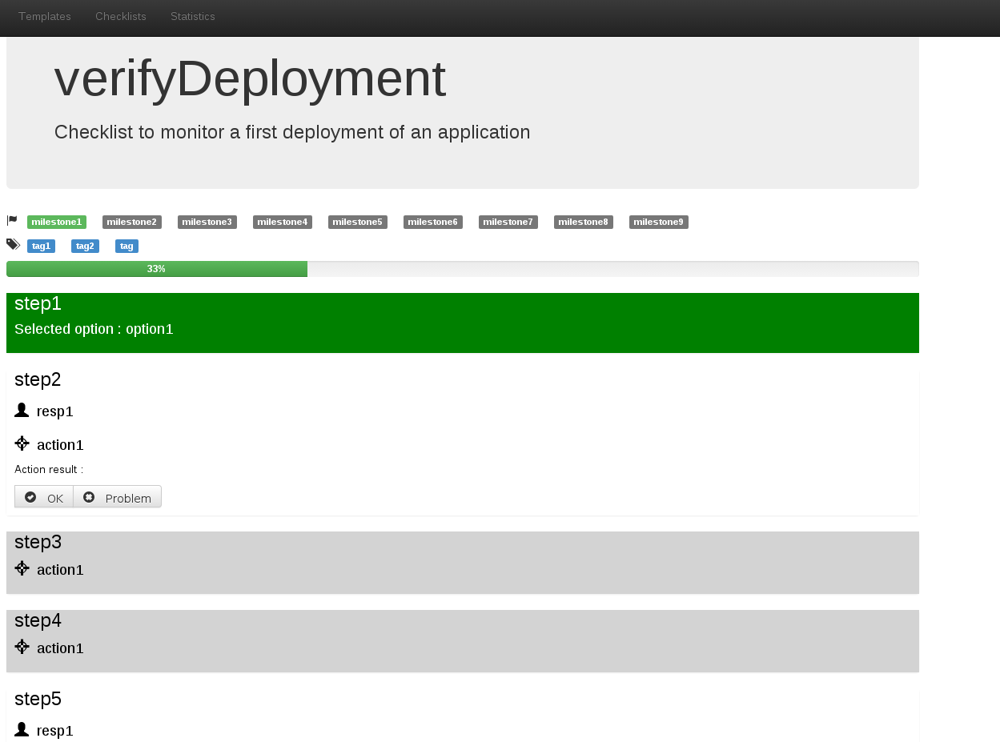
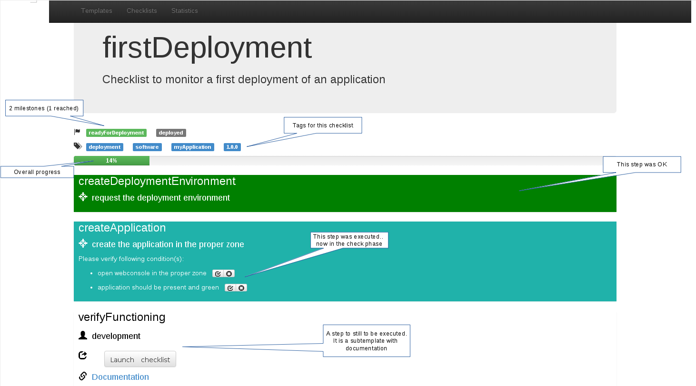
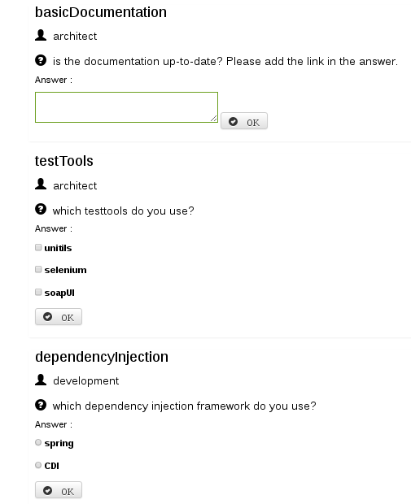
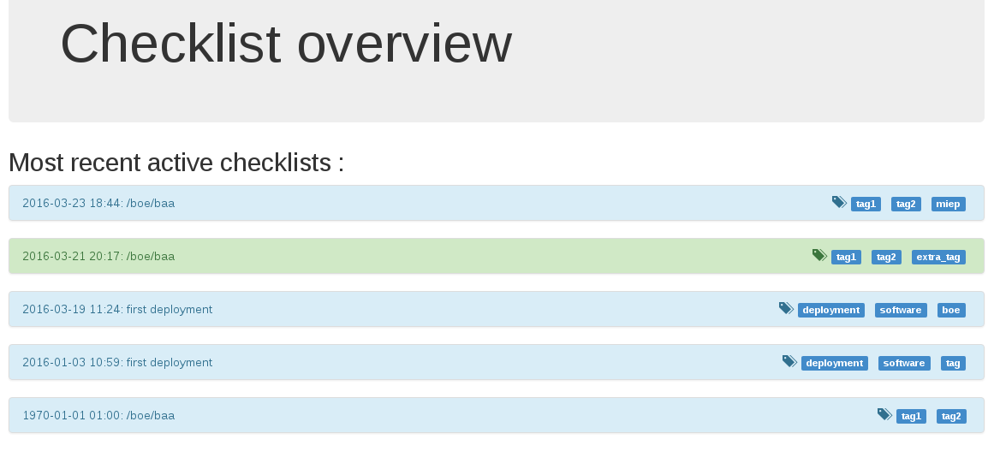
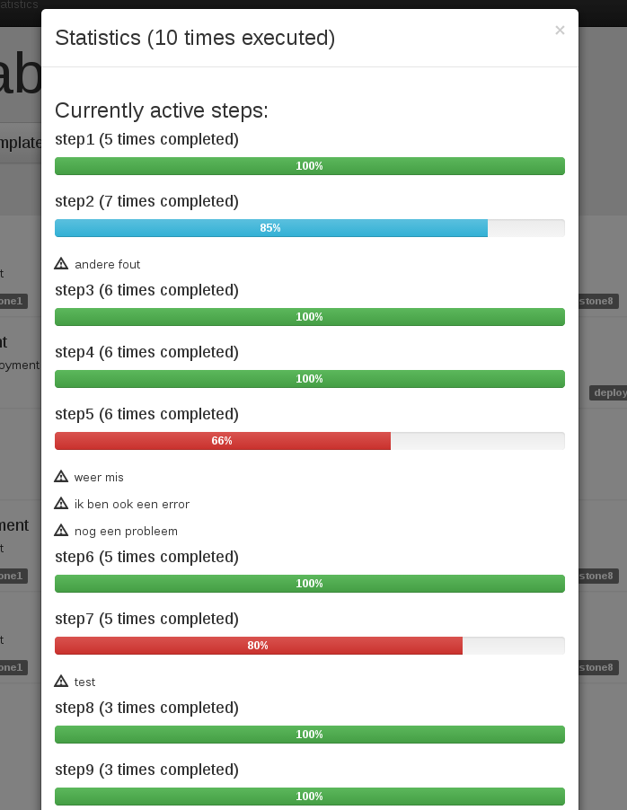
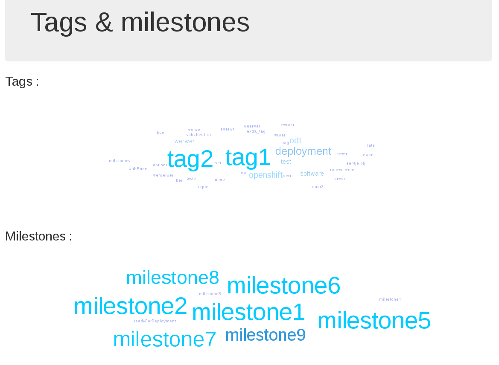

# Checklists

For the reason why even you should use them, read [this extract explanation of why pilots use (and doctors should)](http://thehealthcareblog.com/blog/2007/12/29/pilots-use-checklists-doctors-dont-why-not-by-maggie-mahar/).

Simple GUI application that allows you to handle yaml-described checklists. A simple webapplication exposes the content and statistics to let you detect weak spots in your processes.

It has support for both tags and milestones :

 * tags will organise your templates and checklists. You use them to retrieve them and to group the statistics
 * milestones define a status in the process the checklist supports. You reach a milestone if all checks before that milestone are ok. Via the milestone, you can see which instances of the checklists reached a given state.

## Releases

Stable versions are release on both a branch (/release/<version>) and with a tag (<version>).

Here you can find the [Release notes for the different versions](https://github.com/kullervo16/checklist/releases).

### Release target

The easiest way to use the project is by launching it in a container. You can find all released versions on <a href="https://hub.docker.com/r/kullervo16/checklist/" target="_blank">dockerhub</a>.

## User management

The usermanagement is explained [here](doc/userManagement.md).

## Templates

The templates are defined in YAML. This is the syntax :

```yaml
# description of the procedure that the checklist will support
description: Checklist to monitor a first deployment of an application
# tags help you organise your checklists. The tags in the template are automatically added to all checklists that are 
# based on this template. You can add as many as you need
tags:
    - deployment
    - software
# The steps represent the various parts of the procedure.
steps :    
      # the id must be unique within the template
    - id: createDeploymentEnvironment
      # who should perform this action
      responsible: deployer
      # the action to be performed. You should either have an action, a question or a subchecklist (see further)      
      action: request the deployment environment
      # the verification to be executed when the action is performed. Can be a single item or a list (see next step for example)
      check: log on the deployment station
      # an optional milestone that is considered to be reached when this step is ok
      milestone: readyForDeployment
    - id: createApplication
      responsible: deployer
      action: create the application in the proper zone      
      # an example with multiple checks for 1 action (when you want more than 1 action, simply create new steps)
      check:
          - step: open webconsole in the proper zone
          - step: application should be present and green
      # the weight of this step in the progress bar to get a more realistic progress if you want (if not specified : default = 1)
      weight: 5
    - id: verifyFunctioning
      responsible: development
      # the documentation tag will be rendered as a link in the webgui.. You can use it when you need to give context, add a screenshot... 
      # you simply describe it in a document/wiki/webpage/... and point the user into that direction in your action
      documentation: https://github.com/kullervo16/checklist
      # this will launch a child template. This step will be marked ok when the subchecklist reaches 100%.      
      subchecklist: /development/verifyDeployment
      milestone: deployed
      
```

### Simple flow control

There is also the option to create a simple IF function in your checklists.. This allows you to apply some simple flow control and prevents you from creating
multiple templates that do practically the same thing (which will become a burden to keep them in synch when you want to enhance them).

If you do not specify any expected answer in the condition, the step will be reachable if the step referenced by the stepId is finished or not applicable.

If you specify one or more expected answers in the condition, the step will be reachable if the step referenced by the stepId is finished and if the user
selected at least one of the specified expected answers.

You can specify more than one conditions. In this case, all conditions must be true for the step to be reachable.

This is an example:

```yaml
description: Checklist to verify a deployment
tags:
    - tag1
    - tag2  
# this flag is false per default. If you set it to true, the checklist button will not be shown in the templates page...
subchecklistOnly: false  
steps :    
  - id: step1
    responsible: resp1
    question: Question 1
    options:
      - option1
      - option2
    milestone: milestone1
  - id: step2
    responsible: resp1
    conditions:
      - stepId: step1
        # We accept lists (for single or multiple expected answers)
        expectedAnswers:
          - option1
    action: action2
    check: check1
    milestone: milestone2
  - id: step3
    responsible: resp1
    # The 2 conditions must be true (step1.answers should contain 'option2' and step2 should be finished or unreachable) for this step to be startable. 
    conditions:
      - stepId: step1
        # We accept string (for single expected answer)
        expectedAnswers: option2
      - stepId: step2
    action: action3
    check: check1
    milestone: milestone3
  - id: step4
    responsible: resp1
    conditions:
      - stepId: step1
        expectedAnswers:
          - option2
    action: action4
    check: check1
    milestone: milestone4
  - id: step5
    responsible: resp1
    action: action5
    check: check1
    milestone: milestone5      
  - id: step6
    responsible: resp1
    conditions:
      - stepId: step1
    action: action6
    check: check1
    milestone: milestone5      
```
In the GUI this is represented like this : the steps that are not reachable anymore based on your choices are marked in grey.



### Questions
Sometimes you're not executing actions, but you want to ask a question to make sure the user is reflecting a certain issue. To allow this, you can replace
the action step by a question. The answer to the question will be stored in the checklist. This answer can be a free-form string, or a selection from
some values defined in the template. Here is an example

```yaml
displayName: startProject
# description of the procedure that the checklist will support
description: Checklist to kickoff a new project
# tags help you organise your checklists. The tags in the template are automatically added to all checklists that are 
# based on this template. You can add as many as you need
tags:
    - development
    - software
# The steps represent the various parts of the procedure.
steps :    
      # the id must be unique within the template
    - id: basicDocumentation
      # who should perform this action
      responsible: architect
      # the question to be asked   
      question: is the documentation up-to-date? Please add the link in the answer.
      # you can add checks to see what you mean with "up-to-date"
      check:
          - step: application in the table for the domain
          - step: development team added in the table
          - step: link to the documentation
      # free format answer
      answerType: text      
    - id: testTools
      responsible: architect
      question: which testtools do you use?     
      # this specifies that zero, 1 or more of the options should be selected
      answerType: multiple
      options:
          - unitils
          - selenium
          - soapUI      
    - id: dependencyInjection
      responsible: development
      question: which dependency injection framework do you use?
      # this specifies that only 1 of the options should be selected
      answerType: onlyOne
      options:
          - spring
          - CDI          
     
```
## Web GUI

This simple GUI allows you to select a template and instantiate it in a checklist. The checklist is simply a copy of the YAML template
you select where the GUI allows you to update the status. This enables people without development skills that would be distracted
by the YAML syntax to fill out the checklist.

It applies also some governance : 
 * you cannot change steps marked as done
 * you need to confirm every check point
 * a comment is required for each failing step in order to gather the weaknesses in your process so you can adapt your checklists accordingly

The basic template we saw above is shown like this :



The Web frontend also serves 2 other purposes :
 * allow you to monitor the progress of a given checklist (f.e. on a television screen in your operations room)
 * provide statistics on usage
 
 The statistics will help you see which templates are widely used, but also where the most errors occur. This may point to
 a spot in your process where there is either something unclear, or your previous steps lack proper checks to make them less
 error prone.

This is an example of a checklist with questions :



### Overview
The system shows you the most recent active checklists for quick access (if you do not know the UUID). Color coding shows which ones are complete (green) and 
which ones are still in progress (blue).



There is also a simple stats implemented that shows you which steps of your template fail and what kind of errors you get per step (more will come later on)


You can find your checklists based on the tags and reached milestones. They are presented in the tagcloud in the select page


### Keyboard shorcuts

On the checklist page, you can use the keyboard to do some actions:

-   Navigation:

    -   `DOWN` or `TAB`                            : go to next step
    -   `UP` or `SHIFT+TAB`                        : go to previous step
    -   `SPACE`, `ALT+DOWN` or `ALT+TAB`           : go to next startable or unfinished step
    -   `SHIFT+SPACE`, `ALT+UP` or `SHIFT+ALT+TAB` : go to previous
    -   `P`                                        : go to parent checklist (if exists)

-   Actions:

    -   On a single choice question :

        -   `ENTER` : enter in the step. If no option is selected, selected the first one. Else, focus on the selected one.

        -   When entered in the step:

            -   `DOWN` or `TAB`     : select next option
            -   `UP` or `SHIFT+TAB` : select previous option
            -   `ENTER`             : validate the choice and select the next startable or unfinished step
            -   `ESC`               : leave the step without validating the choice

    -   On a multi-choice question :

        -   `ENTER` : enter in the step andocus on the first option.

        -   When entered in the step:

            -   `DOWN` or `TAB`     : go to next option
            -   `UP` or `SHIFT+TAB` : go to previous option
            -   `SPACE` or `X`      : select/unselect the current option
            -   `ENTER`             : validate the choice and select the next startable or unfinished step
            -   `ESC`               : leave the step without validating the choice

    -   On a free text question :

        -   `ENTER` : enter in the step and place the cursor at the end of the text area.

        -   When entered in the step:

            -   `ALT+ENTER` or `CTRL+ENTER` : validate the response and select the next startable or unfinished step
            -   `ESC`                       : leave the step without validating the response

    -   On a startable action :

        -   `ENTER` : start the action

    -   On a started action :

        -   `ENTER` : mark the action as finished without error

    -   On an action marker as finished without error :

        -   `ENTER` : mark the action as finished without error

    -   On a finished action with not validated checks :

        -   `ENTER` : mark the first not validated check as done withotut error.
                      If no more not validated check, mark the step as finished and select the next startable or unfinished step

    -   On a not started sub-checklist step :
    
        -   `ENTER` : launch the sub-checklist

    -   On a not started sub-checklist step :

        -   `ENTER` : go to the sub-checklist
    
    -   On a reonable step :
    
        -   `R` or `BACKSPACE`: reopen the step

## REST interface

All data is exposed via a REST interface. We support following resources :

* /checklists
* /templates
* /milestones
* /tags
* /userInfo

These resources can be accessed on **/rest/<resource name>**.

## Health

We also expose the health of the application via **/health**. It will report HTTP 200 when ok (with some human readable information), and HTTP 500 otherwise. 

This information can be used to create a monitoring page or in a system like Openshift to allow the system to take action when the application becomes unhealthy.

## Testing

This is described in [the testing documentation](doc/test.md)