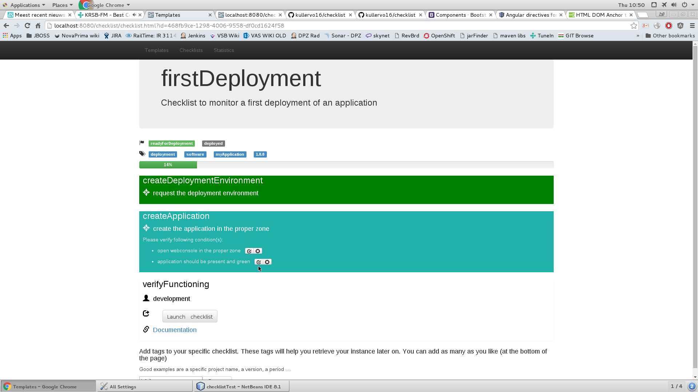
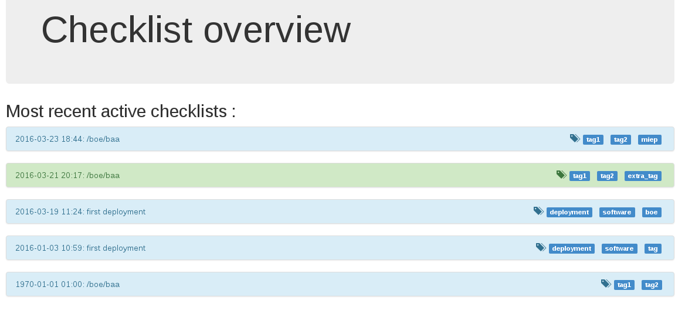

# Checklists

For the reason why even you should use them, read [this extract explanation of why pilots use (and doctors should)](http://thehealthcareblog.com/blog/2007/12/29/pilots-use-checklists-doctors-dont-why-not-by-maggie-mahar/).

Simple GUI application that allows you to handle yaml-described checklists. A simple webapplication exposes the content and statistics to let you detect weak spots in your processes.

It has support for both tags and milestones :

 * tags will organise your templates and checklists. You use them to retrieve them and to group the statistics
 * milestones define a status in the process the checklist supports. You reach a milestone if all checks before that milestone are ok. Via the milestone, you can see which instances of the checklists reached a given state.

## Releases

Current release : 0.1

Here you can find the [Release notes for the different versions](./release.md).

### Release target

The project contains a Dockerfile. You can also find the released versions on dockerhub.

## Templates

The templates are defined in  YAML. This is the syntax :

```yaml
# description of the procedure that the checklist will support
description: Checklist to monitor a first deployment of an application
# tags help you organise your checklists. The tags in the template are automatically added to all checklists that are 
# based on this template. You can add as many as you need
tags:
    - deployment
    - software
# The steps represent the various parts of the procedure.
steps :    
      # the id must be unique within the template
    - id: createDeploymentEnvironment
      # who should perform this action
      responsible: deployer
      # the action to be performed. You should either have an action or a subchecklist (see further)      
      action: request the deployment environment
      # the verification to be executed when the action is performed. Can be a single item or a list (see next step for example)
      check: log on the deployment station
      # an optional milestone that is considered to be reached when this step is ok
      milestone: readyForDeployment
    - id: createApplication
      responsible: deployer
      action: create the application in the proper zone      
      # an example with multiple checks for 1 action (when you want more than 1 action, simply create new steps)
      check:
          - step: open webconsole in the proper zone
          - step: application should be present and green
      # the weight of this step in the progress bar to get a more realistic progress if you want (if not specified : default = 1)
      weight: 5
    - id: verifyFunctioning
      responsible: development
      # the documentation tag will be rendered as a link in the webgui.. You can use it when you need to give context, add a screenshot... 
      # you simply describe it in a document/wiki/webpage/... and point the user into that direction in your action
      documentation: https://github.com/kullervo16/checklist
      # this will launch a child template. This step will be marked ok when the subchecklist reaches 100%
      subchecklist: /development/verifyDeployment
      milestone: deployed
      
```

## Web GUI (WIP)

This simple GUI allows you to select a template and instantiate it in a checklist. The checklist is simply a copy of the YAML template
you select where the GUI allows you to update the status. This enables people without development skills that would be distracted
by the YAML syntax to fill out the checklist.

It applies also some governance : 
 * you cannot change steps marked as done
 * you need to confirm every check point
 * a comment is required for each failing step in order to gather the weaknesses in your process so you can adapt your checklists accordingly

The template above is shown like this :



The Web frontend also serves 2 other purposes :
 * allow you to monitor the progress of a given checklist (f.e. on a television screen in your operations room)
 * provide statistics on usage
 
 The statistics will help you see which templates are widely used, but also where the most errors occur. This may point to
 a spot in your process where there is either something unclear, or your previous steps lack proper checks to make them less
 error prone.

### Simple flow control
There is also the option to create a simple IF function in your checklists.. This allows you to apply some simple flow control and prevents you from creating
multiple templates that do practically the same thing (which will become a burden to keep them in synch when you want to enhance them). This is an example

```yaml
description: Checklist to verify a deployment
tags:
    - tag1
    - tag2    
steps :    
    - id: step1
      responsible: resp1
      options:
          - option1
          - option2
      milestone: milestone1
    - id: step2
      responsible: resp1
      condition:
          - selectionPoint: step1
          - option: option1
      action: action1
      check: check1
      milestone: milestone2
    - id: step3
      responsible: resp1
      condition:
          - selectionPoint: step1
          - option: option2
      action: action1
      check: check1
      milestone: milestone3
    - id: step4
      responsible: resp1
      condition:
          - selectionPoint: step1
          - option: option2
      action: action1
      check: check1
      milestone: milestone4
    - id: step5
      responsible: resp1
      action: action1
      check: check1
      milestone: milestone5      
```
In the GUI this is represented like this : the steps that are not reachable anymore based on your choices are marked in grey.


The system shows you the most recent active checklists for quick access (if you do not know the UUID). Color coding shows which ones are complete (green) and 
which ones are still in progress (blue).



## GIT backend (TODO)

The idea is to use a file based backend with GIT as a remote synchronisation store. The backend will commit and push after each update, so that the GIT is always up to date.
If you loose your data (or you are using a 100% container approach and do not use persistent storage at all), the system will pull from the GIT to restore its state.


## Testing

There are minimal unit tests in this project, only to test the low level stuff. Since the in-memory backend is so fast, the actual tests are written as integration tests running against a deployed backend. 
That way we test the real thing, and we are sure you can use the API also with rest-easy directly (so not only as an angular js client). Check out the checklistTest for more information (or as a demonstration of the API).